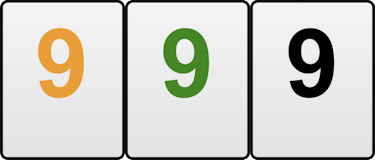
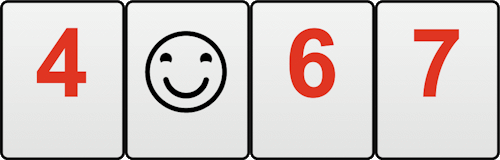

# Rummi Rules
## The Game
There are 106 tiles in the game including 2 jokers. There are 4 different color tiles, 
black, red, yellow, and green numbering 1 through 13. All tiles are shuffled together. 
Each player gets 14 random tiles wich are placed on their rack.
Objective
The objective of the game is to be the first to eliminate all the tiles from your rack by 
forming them into sets of runs and groups, and then melding them onto the table.
All runs must consist of at least 3 tiles of the same color and consecutive rank. A run 
with tiles 12-13-1 is not valid.

Groups must consist of 3 or 4 tiles of different colors with the same rank.

## Jokers
A joker may be substituted for any tile when you make a meld. The joker may be 
substituted with tiles already played. You may not hold a substituted joker to use in a 
later turn. You may use and rearrange Jokers in any way you like, without any 
restriction other than that each tile must end up being part of a valid meld.

## Play
In order to place tiles on the table each player must make an initial meld of 30 points 
in one or more sets. In Easy level this is 24 points, in Hard it is 36 points. These points 
must come from tiles in the hand only and not from tiles already on the table. Once 
you have placed your initial points down, you are free to play on the table and 
manipulate and rearrange melds. You may not use other players' tiles to make the 
initial points.
If you cannot add onto the other runs or groups of yours or opponents, you must pick 
a tile from the table. Then you must wait until your next turn to play.

## Scoring
Once a winner has been declared, the losing players must add up the values of the 
tiles remaining in their racks (their score for the game). The joker has a penalty value 
of 50. A player's score for the game is subtracted from his current cumulative score. 
Once calculated, each of the losing players' scores for the game is added to the 
winners current cumulative score. For example- suppose in a game player A wins, 
player B has a score of 5, player C has a score of 10 and player D a score of 3. Player A 
will now have a cumulative score of 18, player B will be -5, player C will be -10 and 
player D will be -3. Should the game result in no winner, the player with the least 
number of tiles in their rack is the winner. Scoring is then carried out in the normal 
manner.
