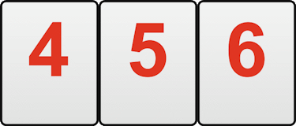

# Het spel
Het spel bevat 106 stenen, waaronder 2 jokers. Er zijn 4 verschillende kleuren stenen: 
zwart, rood, geel en groen, met de nummers 1 tot en met 13. Alle stenen worden door elkaar 
geschud. Elke speler krijgt 14 willekeurige stenen, die op zijn of haar plankje worden gelegd.

# Doelstelling
Het doel is om als eerste alle stenen van je plankje kwijt te raken door er rijen en groepen 
van te maken en deze vervolgens op tafel te leggen.
Elke rij moet uit minimaal 3 stenen van dezelfde kleur met opeenvolgende nummers bestaan. Een rij 
met de stenen 12-13-1 is niet geldig.

Groepen moeten bestaan uit 3 of 4 stenen van verschillende kleuren met hetzelfde nummer.

# Jokers
Een joker mag bij het maken van een combinatie elke steen vervangen. De joker mag ook 
een steen vervangen die al op tafel ligt. Je mag een vervangen joker niet bewaren om hem 
in een latere beurt te gebruiken. Je mag jokers op elke gewenste manier gebruiken en 
verplaatsen, zolang elke steen uiteindelijk deel uitmaakt van een geldige combinatie.

# Spelverloop
Om stenen op tafel te mogen leggen, moet elke speler de eerste keer uitleggen met een minimaal aantal punten in één of meerdere sets. 
Het aantal benodigde punten is afhankelijk van het niveau van het spel, zie tabel hieronder.

Niveau|Minimaal aantal Punten
:--|--:
Simpel|27
Middel|30
Moeilijk|33
Expert|36

Deze punten moeten uitsluitend afkomstig zijn van stenen uit je plankje 
en niet van stenen die al op tafel liggen. Nadat je je eerste punten hebt gelegd, mag je 
op tafel spelen en combinaties aanpassen en herschikken. Je mag geen stenen van andere 
spelers gebruiken om de eerste keer uit te leggen.
Als je niets kunt toevoegen aan de rijen of groepen van jezelf of van je tegenstanders, 
moet je een steen van de tafel pakken. Daarna moet je wachten tot je volgende beurt om te spelen.

# Puntentelling
Nadat een winnaar is uitgeroepen, tellen de verliezende spelers de waarden van de 
stenen die op hun plankjes zijn overgebleven bij elkaar op (hun score voor dit spel). 
De joker heeft een strafwaarde van 50. De score van een speler voor het spel wordt 
afgetrokken van zijn of haar huidige cumulatieve score. Zodra dit is berekend, wordt 
de score van elke verliezende speler voor het spel opgeteld bij de huidige cumulatieve 
score van de winnaar. Stel bijvoorbeeld dat in een spel speler A wint, speler B een 
score van 5 heeft, speler C een score van 10 en speler D een score van 3. Speler A 
heeft dan een cumulatieve score van 18, speler B -5, speler C -10 en speler D -3. 
Als het spel eindigt zonder winnaar, is de speler met het kleinste aantal stenen op 
zijn of haar plankje de winnaar. De puntentelling wordt dan op de normale manier 
uitgevoerd.
